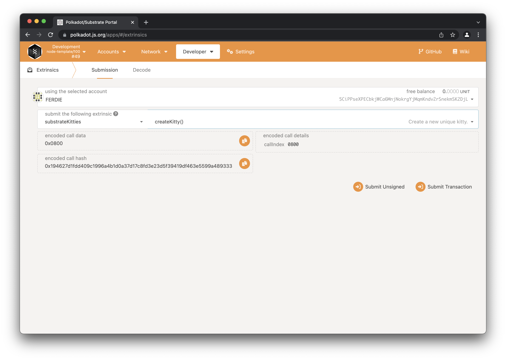
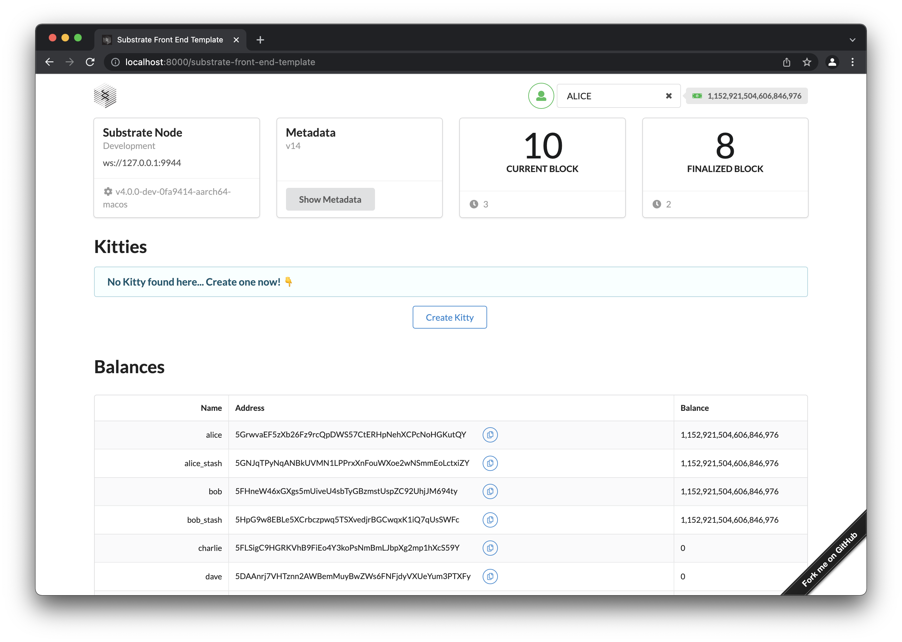

# Launch

Now its time to launch your chain and interact with it.

1. Build your chain:

```bash
cargo build --release
```

2. Launch it:

```bash
./target/release/node-template --dev
```

3. Open up [Polkadot JS Apps](https://polkadot.js.org/apps/?rpc=ws%3A%2F%2F127.0.0.1%3A9944#/explorer), connect to your local node under "Development".

4. Then head to "Developer -> Extrinsics" and submit a transaction using the `substrateKitties` pallet.



<!-- slide:break -->

# Extra

We have built a custom front-end for the Substrate Kitties Pallet.

You can clone that project here:

```bash
git clone https://github.com/substrate-developer-hub/substrate-front-end-template/ --branch tutorials/solutions/kitties
```

Then build and start the project:

```
yarn && yarn start
```

Make sure your `substrate-node-template` is also running and you should see the UI:



Congratulations for completing this workshop with us! 🥳

Curious how you could write tests for your pallets? You can check the solution code of the kitties pallet [here](https://github.com/substrate-developer-hub/substrate-node-template/tree/tutorials/solutions/kitties/pallets/kitties) which includes tests that you can run using `cargo test -p pallet-kitties`.
